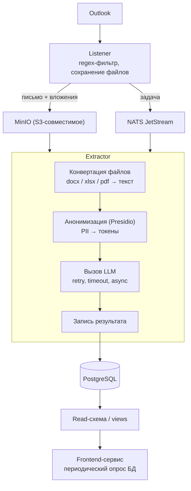

# Aircraft Parts RFQ Extraction Pipeline

## 1. Контекст и задача

Компания получает по электронной почте (Outlook) запросы на поставку авиационных деталей (RFQ — Request for Quotation) от клиентов. Запросы приходят в произвольном, не стандартизированном формате:

- текст прямо в теле письма;
- приложенный `.docx` файл;
- приложенная Excel-таблица (`.xlsx`);
- приложенный PDF-документ.

Из каждого такого запроса нужно извлечь структурированные данные о запрашиваемых деталях:

- **ID детали** (part number);
- **описание** детали;
- **запрошенное количество**;
- **альтернативы** (альтернативные part number, если указаны клиентом).

Извлечённые структурированные данные сохраняются в базу данных и далее используются другим сервисом для дальнейшей обработки.

Поскольку формат входных данных непредсказуем и не имеет фиксированной структуры (свободный текст, таблицы произвольной структуры, сканы/PDF), извлечение данных выполняется с помощью LLM, а не жёстких парсеров/regex-правил. Regex используется только на раннем этапе как быстрый и дешёвый фильтр "похоже ли это письмо на запрос деталей вообще", а не как основной инструмент извлечения.

## 2. Архитектура

Система состоит из двух независимых микросервисов, связанных через очередь сообщений и объектное хранилище. Сервисы не вызывают друг друга напрямую — это позволяет им масштабироваться, деплоиться и переживать сбои независимо.

### 2.1. Listener

Назначение: подключение к почтовому ящику Outlook, первичная фильтрация и постановка задач в очередь.

Поток обработки:

1. Слушает почтовый ящик (новые письма).
2. При получении письма выполняет быструю проверку по регулярным выражениям — есть ли признаки запроса на детали в теле письма.
3. Если проверка пройдена:
   - сохраняет тело письма и все вложения (docx/xlsx/pdf) в объектное хранилище в исходном, неизменном виде;
   - публикует задачу в очередь сообщений со ссылками на сохранённые объекты (ключи в хранилище) и метаданными письма (отправитель, дата, тема и т.п.).
4. Если проверка не пройдена — письмо игнорируется (не запрос на детали)

### 2.2. Extractor

Назначение: извлечение структурированных данных о деталях из неструктурированного содержимого письма/вложений с помощью LLM.

Поток обработки одной задачи:

1. Получает задачу из очереди (с подтверждением — ack только после успешной обработки, чтобы не терять задачи при сбое воркера).
2. Загружает соответствующие файлы из объектного хранилища по ключам из задачи.
3. **Конвертация в текст**: docx/xlsx/pdf преобразуются в текстовое представление специализированными python-библиотеками.
4. **Анонимизация**: текст прогоняется через Presidio для маскирования персональных данных (имена, email, телефоны и т.п.) перед отправкой во внешний LLM API. Анонимизация выполняется как отдельный шаг между конвертацией и вызовом LLM.
5. **Вызов LLM**: анонимизированный текст передаётся в LLM с промптом на извлечение структурированных данных (id детали, описание, количество, альтернативы). Вызов оборачивается в retry с backoff и таймаутами на случай сетевых сбоев или rate limit со стороны провайдера.
6. **Сохранение результата**: структурированный ответ LLM записывается в PostgreSQL.

### 2.3. Хранилище данных

- **PostgreSQL** — хранит структурированные результаты извлечения (детали, количество, альтернативы, ссылки на исходное письмо).
- Extractor пишет во "внутренние" таблицы. Для фронтенд-сервиса, который читает эти же данные для отображения, выделена **отдельная read-схема / набор views** — это фиксирует контракт между сервисами и защищает фронтенд от изменений внутренней схемы Extractor. Доступ фронтенда к БД — через read-only пользователя.

## 3. Инфраструктура

| Компонент | Технология | Назначение |
|---|---|---|
| Очередь сообщений | NATS JetStream | Передача задач от Listener к Extractor, ack/nack, at-least-once delivery |
| Объектное хранилище | MinIO (S3-совместимое) | Хранение исходных писем и вложений (docx/xlsx/pdf) в неизменном виде |
| База данных | PostgreSQL | Хранение структурированных результатов извлечения |
| LLM | внешний API | Извлечение структурированных данных из неструктурированного текста |
| Анонимизация PII | Microsoft Presidio | Маскирование персональных данных перед отправкой в LLM |

Все инфраструктурные компоненты (NATS, MinIO, PostgreSQL) поднимаются локально через `docker-compose`.

## 4. Ключевые архитектурные решения и их обоснование

- **Конвертация файлов происходит в Extractor, а не в Listener** — чтобы Listener оставался простым и быстрым, а исходные файлы сохранялись в неизменном виде для возможной переобработки.
- **Анонимизация происходит непосредственно перед вызовом LLM, после конвертации в текст** — это единственная точка, где текст уходит во внешний API, и единственное место, где PII представляет риск.
- **Де-анонимизация результата не выполняется** — результат извлечения сохраняется в БД как есть, без восстановления исходных PII-значений.
- **Общая БД для Extractor (запись) и фронтенд-сервиса (чтение)** — допустимый паттерн при условии, что между сервисами зафиксирован явный контракт (read-схема/views, read-only доступ), а не прямой доступ к внутренним таблицам.
- **Отсутствие промежуточных статусов задачи** — упрощение: фронтенд просто периодически перечитывает таблицу результатов, не требуя от пайплайна поддержки и обновления состояния обработки.